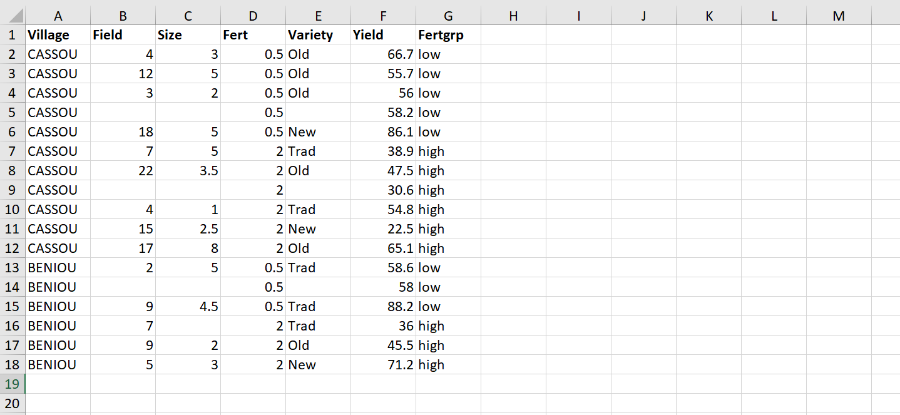
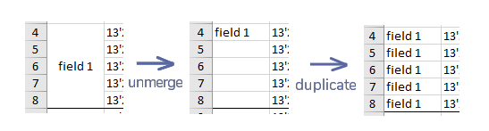
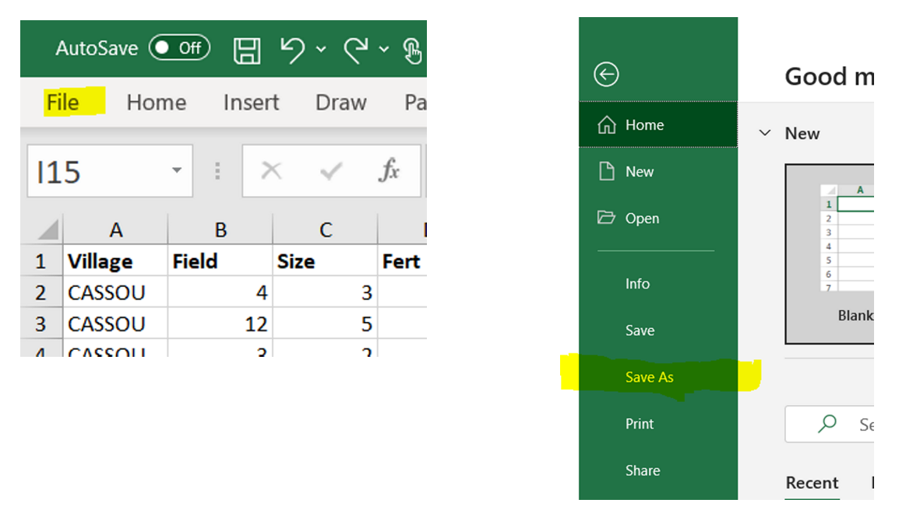

```{r setup, include=FALSE}
library(learnr)
library(tidyverse)
tutorial_options(exercise.timelimit = 10)
```


## Overview

In this workbook, we will learn the process of importing data into R, which consists in

- making sure the data has the right shape
- saving the data in an R-friendly format
- importing the data from RStudio


Here is a video where these steps are briefly explained:


## Shaping the data
First let's talk about data shape. If you want to import data into R - or into any statistical software really - you need your data to have the right shape. It should take the form of one single "rectangle" of data, made of columns and rows that don't vary in size, and where

- Each row represents one observation
- Each column represents one variable

The R community calls it *tidy data*. Here is a nice presentation illustrating this tidy data concept: <a href="https://docs.google.com/presentation/d/1N7hKepabvl9OrHjvGJWPjUsfzVdB5xzV5AsFndgSwms/edit?usp=sharing" target="_blank">Make friends with tidy data </a> 

You also want your column names to be at the very top, in one **single** row, and the rest of your data to start right below this first row, like in this screenshot.

```{r echo=FALSE, out.width="100%", fig.align='left'}

```

Everything in your rectangle of data should be part of your data. There's no problem with having empty cells, but these have to be empty because the corresponding values are missing. 


### Avoid merging cells
In spreadsheets like Excel, it is tempting to merge cells in order to make things look nicer. The issue is that merged cells don't transfer well to other softwares. So if you want to look at your data from R or any other statistical software, don't merge your cells. Instead, copy the value in all the corresponding cells.
```{r echo=FALSE, out.width="80%", fig.align='left'}

```

### Column names good practice
It is best to keep your column names meaningful, yet short, and to avoid spaces, accent and other special characters, except for the dot and the underscore symbols. As an example, "Température Minimale", could be shortened to "temp.min". 


### Missing values

As said above, having missing data is totally fine. I mean, it may be an issue for your analysis, but it is not an issue for importing data. It is common for people to have a specific code to represent missing values, like -1, 99 or NA. These are all fine. What's important is to choose a code that cannot be a value taken by your non-missing data, and to be consistent. If you code missing values differently for each of your columns, you're asking yourself for trouble. My personal preference is to simply leave the cell empty. An empty cell is easy to spot and R will recognize it automatically as a missing value.


## File format

If your data lies in a spreadsheet like Excel, Google Sheets or LibreOffice Calc, we recommend you save your data as a csv file. There are external packages that can help you import data directly from Excel, but in our experience, things are more likely to go smoothly if you import your data from a csv file. A csv file is a simple text file where your values are separated by a specific character. As "csv" stands for "comma separated value", you can guess that in general, this specific character is the comma.

Download this excel file and follow the steps, using the tab called "Exple1 - good" as the data sheet we want to save: [BasicExample.xlsx](https://github.com/stats4sd/r2020_04Rstudio/raw/main/BasicExample.xlsx)
Note that if you don't have excel on your computer, use any spreadsheet software that you like. The steps should be very similar.


click on the tab of the data that you want to save. Check that the data is in the right shape, then click `file -> save as`

```{r echo=FALSE, out.width="80%", fig.align='left'}

```

Choose where you want to save your file, give it a sensible names, and in `save as types`, choose 'CSV (comma delimited)' (or similar). It is recommended to save it in the relevant R project.
```{r echo=FALSE, out.width="100%", fig.align='left'}
knitr::include_graphics("./images/save3.png")
```

Finally click `save`. You may then get a warning that you are saving only one of your sheets, which is normal. You just want to save the data in the active tab.


If your data comes from another statistical software like SAS, SPSS, STATA, then, your data is already in a nice format for importation.


*Question: download the following excel file containing data from the 2019 World Happiness Report and try to save it as a csv file, following the steps above*
[Happiness.xlsx](https://github.com/stats4sd/r2020_04Rstudio/raw/main/Happiness.xlsx)


## Importing data


### Have your R Markdown file ready

To start with, you should be on your project folder and have a new R Markdown file open (File -> New file -> R Markdown...).
```{r echo=FALSE, out.width="80%", fig.align='left'}
knitr::include_graphics("./images/rmarkdown.png")
```


A new R Markdown file comes with examples of text and commands. We don't need them here. Delete everything to have an empty file. 


### Importing your file

For data coming from SAS, SPSS or STATA, you will have to use an external package to import your file into R. There are multiple options, but we recommend you use the package haven, which is another package included in tidyverse. What's nice with this package is that it is embeded in the RStudio importation menu, and so the method to import data works the same way as with a csv file. That is:


From Rstudio, click on the `import dataset` menu. It is located at the top right of your screen if you haven't changed the default organisation of the Rstudio windows. If you've copied Andy Field's organisation, then it may be at the bottom left of your screen.
```{r echo=FALSE, out.width="100%", fig.align='left'}
knitr::include_graphics("./images/import1.png")
```

You can see that you have several options to choose from. If you were importing data from SAS, SPSS or STATA, you would use the relevant option at the bottom. This requires the package Haven to be installed, but as said before, it is part of tidyverse, so if tidyverse is installed, it should work well. But if your data is saved as a csv file, you should just click on the first option `From Text (base)`
```{r echo=FALSE, out.width="70%", fig.align='left'}
knitr::include_graphics("./images/import2.png")
```


Locate your csv file
```{r echo=FALSE, out.width="70%", fig.align='left'}
knitr::include_graphics("./images/import3.png")
```

Check in the preview window that the importation seems to work well. If you see some issues like weird column names, weird rows or columns, play with the parameters on the left to fix the issues. Click `import`
```{r echo=FALSE, out.width="80%", fig.align='left'}
knitr::include_graphics("./images/import4.png")
```


Check your environment window for the number of rows and columns of your new object.
```{r echo=FALSE, out.width="60%", fig.align='left'}
knitr::include_graphics("./images/import5.png")
```


Copy the command that R just wrote in the console (only the `read.csv()` command. The `View()` command is an interactive command that should not be on your scripts).
```{r echo=FALSE, out.width="80%", fig.align='left'}
knitr::include_graphics("./images/import7.png")
```

Insert a first R chunk at the top of your R Markdown file
```{r echo=FALSE, out.width="50%", fig.align='left'}
knitr::include_graphics("./images/import8.png")
```


Then paste the importing command inside the R chunk 
```{r echo=FALSE, out.width="70%", fig.align='left'}
knitr::include_graphics("./images/import9.png")
```

We are done with the importation step. We can now start working on this data. Don't forget to load the libraries that you will need and to write text outside the R chunks to describe what you're doing.
```{r echo=FALSE, out.width="100%", fig.align='left'}
knitr::include_graphics("./images/import10.png")
```


Having the importation command in your R Markdown script file is important, so that the next time you open RStudio, you don't have to go through the importation process again. You can just run the command that is in your file. Next time, when you open your R Markdown, you will just need to run the R chunk and your data will be imported!

Note: you can see that the importation command contains a path to your data file. So if you move your data, for example to place it in a specific data folder in your project, you'll have to change the path.


*Question: follow the steps above to import the Happiness.csv file that you saved in the previous section*


## Appendix:  Useful reference links  


Illustrated presentation of 'tidy data': <a href="https://docs.google.com/presentation/d/1N7hKepabvl9OrHjvGJWPjUsfzVdB5xzV5AsFndgSwms/edit?usp=sharing" target="_blank">Make friends with tidy data </a> 

Video explaining the command to import text files into R - DataCamp:<a href="https://www.youtube.com/watch?v=Yy-ismDUkkQ" target="_blank">https://www.youtube.com/watch?v=Yy-ismDUkkQ   </a> 

Article on the RStudio support site showing how to import data from different files via the RStudio import menu:<a href="https://support.rstudio.com/hc/en-us/articles/218611977-Importing-Data-with-RStudio" target="_blank">Importing Data with RStudio</a> 


